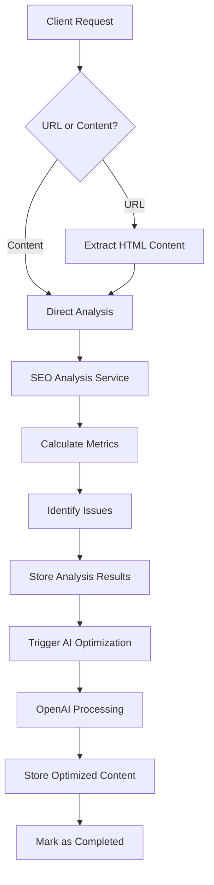
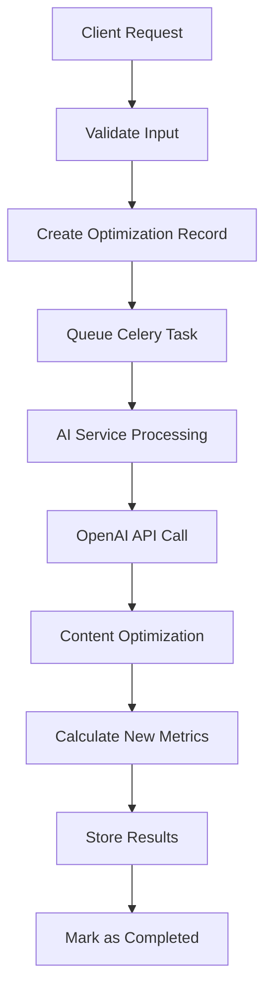

# SEO Optimizer API

A comprehensive SEO analysis and content optimization platform powered by AI that helps improve content for search engines through automated analysis and intelligent optimization.

## 🚀 Overview

The SEO Optimizer API is a Django-based REST API that provides:

- **SEO Analysis**: Analyze web pages or raw content for SEO metrics and issues
- **Content Optimization**: AI-powered content optimization with customizable tones and lengths
- **Asynchronous Processing**: Background task processing using Celery and Redis
- **Real-time Tracking**: Monitor analysis and optimization progress via unique record IDs
- **Comprehensive Metrics**: Keyword density, readability scores, SEO scores, and issue detection

## 🏗️ System Architecture

### High-Level Architecture

```
┌─────────────────┐    ┌─────────────────┐    ┌─────────────────┐
│   Client App    │    │    Web Layer    │    │  Service Layer  │
│                 │───▶│   Django REST   │───▶│   SEO Services  │
│  (Frontend/API) │    │   Framework     │    │   AI Services   │
└─────────────────┘    └─────────────────┘    └─────────────────┘
                                │                        │
                                ▼                        ▼
                       ┌─────────────────┐    ┌─────────────────┐
                       │   Data Layer    │    │  Background     │
                       │   PostgreSQL    │    │  Processing     │
                       │   Database      │    │  (Celery/Redis) │
                       └─────────────────┘    └─────────────────┘
                                                       │
                                                       ▼
                                              ┌─────────────────┐
                                              │  External APIs  │
                                              │    OpenAI       │
                                              │   Web Scraping  │
                                              └─────────────────┘
```

### Component Architecture

```
apps/seo_app/
├── api/                    # API Layer
│   ├── views/             # REST API Views
│   ├── serializers/       # Data Serialization
│   └── urls.py           # URL Routing
├── models.py              # Data Models
├── services/              # Business Logic Layer
│   ├── ai/               # AI Integration Services
│   ├── seo/              # SEO Analysis Services
│   └── common/           # Shared Utilities
├── tasks/                 # Background Tasks
└── tests/                # Test Suite
```

## 🔄 System Design & Data Flow

### 1. Analysis Workflow



### 2. Optimization Workflow



### 3. Data Flow Architecture

```
┌─────────────┐     ┌─────────────┐     ┌─────────────┐
│   Request   │────▶│  Validation │────▶│   Database  │
│   (JSON)    │     │ & Business  │     │   Storage   │
└─────────────┘     │    Logic    │     └─────────────┘
                    └─────────────┘             │
                            │                   ▼
                            ▼          ┌─────────────┐
                   ┌─────────────┐     │   Celery    │
                   │   Response  │◄────│    Task     │
                   │   (JSON)    │     │   Queue     │
                   └─────────────┘     └─────────────┘
                                              │
                                              ▼
                                     ┌─────────────┐
                                     │  Background │
                                     │ Processing  │
                                     │ (Analysis/  │
                                     │Optimization)│
                                     └─────────────┘
```

## 📊 Data Models

### BaseRecord (Abstract)
- **Purpose**: Common fields for all records
- **Fields**: 
  - `id` (UUID): Unique identifier
  - `status` (String): Processing status
  - `target_keyword` (String): SEO target keyword
  - `input_content` (Text): Original content
  - `optimized_content` (Text): AI-optimized content
  - `optimized_improvements` (JSON): List of improvements made
  - `processing_time` (BigInteger): Processing time in milliseconds
  - `created_at` / `completed_at` (DateTime): Timestamps

### AnalysisRecord
- **Purpose**: SEO analysis results
- **Additional Fields**:
  - `input_url` (URL): Source URL for analysis
  - `seo_score` (Float): Overall SEO score (0-100)
  - `word_count` (Integer): Content word count
  - `keyword_density` (Float): Keyword density percentage
  - `avg_sentence_length` (Float): Average sentence length
  - `readability_score` (Float): Flesch reading ease score
  - `issues` (JSON): Identified SEO issues

### OptimizationRecord
- **Purpose**: Content optimization results
- **Additional Fields**:
  - `target_length` (Integer): Target word count
  - `tone` (String): Desired content tone
  - `optimized_keyword_density` (Float): Optimized keyword density

## 🔧 Service Layer Architecture

### SEO Services (`apps/seo_app/services/seo/`)

#### SEOAnalyzer
- **Purpose**: Core SEO analysis engine
- **Functions**:
  - Word count calculation
  - Keyword density analysis
  - Readability scoring (Flesch Reading Ease)
  - HTML structure analysis (headings, meta descriptions)
  - SEO issue detection
  - Overall SEO score calculation

#### Constants
- **Purpose**: SEO configuration and issue definitions
- **Contains**: Issue severity levels, scoring penalties, recommendations

### AI Services (`apps/seo_app/services/ai/`)

#### SEOOptimizerService
- **Purpose**: AI-powered content optimization
- **Integration**: OpenAI GPT-4o-mini
- **Functions**:
  - `post_analysis_optimize()`: Optimize based on analysis results
  - `optimize()`: Custom optimization with tone and length
- **Features**: JSON response validation, error handling, retry logic

### Common Services (`apps/seo_app/services/common/`)

#### HTML Extraction
- **Purpose**: Web content extraction and cleaning
- **Functions**:
  - `extract_html()`: Extract and clean HTML content
  - `extract_text_from_html()`: Convert HTML to plain text
- **Features**: Tag filtering, content sanitization, timeout handling

## 🔄 Background Processing

### Celery Tasks (`apps/seo_app/tasks/`)

#### analyze_content_task
- **Purpose**: Asynchronous SEO analysis
- **Process**:
  1. Fetch content (URL extraction or direct content)
  2. Run SEO analysis
  3. Store results in database
  4. Trigger optimization task
- **Retry**: 3 attempts with exponential backoff

#### optimize_after_analysis_task
- **Purpose**: AI optimization after analysis
- **Process**:
  1. Use analysis results for context
  2. Call OpenAI for optimization
  3. Store optimized content and improvements
- **Context**: Leverages analysis metrics for better optimization

#### optimize_content_task
- **Purpose**: Direct content optimization
- **Process**:
  1. Apply custom tone and length requirements
  2. Call OpenAI for optimization
  3. Calculate new keyword density
  4. Store results

### Task Configuration
- **Broker**: Redis
- **Result Backend**: Redis
- **Max Retries**: 3
- **Retry Delay**: 10 seconds (exponential backoff)
- **Error Handling**: Graceful failure with status updates

## 🌐 API Layer

### Endpoints

#### Analysis Endpoints
- `GET /api/analyze` - List all analysis records (paginated)
- `POST /api/analyze` - Create new analysis record
- `GET /api/analyze/{id}` - Retrieve specific analysis record

#### Optimization Endpoints
- `GET /api/optimize` - List all optimization records (paginated)
- `POST /api/optimize` - Create new optimization record  
- `GET /api/optimize/{id}` - Retrieve specific optimization record

#### Documentation Endpoints
- `GET /docs/` - Swagger UI documentation
- `GET /redoc/` - ReDoc documentation
- `GET /swagger.json` - OpenAPI schema

### Request/Response Format

#### Analysis Request
```json
{
  "url": "https://example.com/page",  // OR
  "content": "Raw content text",
  "target_keyword": "seo optimization"
}
```

#### Optimization Request
```json
{
  "content": "Content to optimize",
  "target_keyword": "target keyword",
  "target_length": 500,
  "tone": "professional"
}
```

#### Response Format
```json
{
  "id": "uuid-string",
  "status": "pending|processing|completed|failed",
  "created_at": "2024-01-01T00:00:00Z",
  // ... additional fields based on completion
}
```

## 🐳 Docker Setup & Deployment

### Services Architecture

```yaml
services:
  db:          # PostgreSQL Database
  redis:       # Message Broker & Cache
  django-api:  # Django REST API Server
  celery-worker: # Background Task Processor
```

### Environment Configuration .env file

```bash
# Database Configuration
POSTGRES_DB=postgres
POSTGRES_USER=postgres
POSTGRES_PASSWORD=postgres
POSTGRES_HOST=db
POSTGRES_PORT=5432

# Redis Configuration
REDIS_URL=redis://redis:6379
CELERY_BROKER_URL=redis://redis:6379/0
CELERY_RESULT_BACKEND=redis://redis:6379/0

# Django Configuration
SECRET_KEY=your-secret-key
DEBUG=True
ALLOWED_HOSTS=["*"]

# OpenAI Configuration
OPEN_AI_SECRET_KEY=your-openai-api-key

# settings
CORS_ALLOW_ALL_ORIGINS=True
CORS_ALLOW_CREDENTIALS=True
```

## 🚀 Getting Started

### Prerequisites
- Docker & Docker Compose
- Python 3.12+ (for local development)
- OpenAI API Key

### Quick Start with Docker

1. **Clone the repository**
   ```bash
   git clone <repository-url>
   cd SEOptimizer
   ```

2. **Configure environment**
   ```bash
   
   # create .env file and put proper settings and keys
   ```

3. **Start all services**
   ```bash
   docker-compose up -d
   ```

4. **Run database migrations**
   ```bash
   docker-compose exec django-api python manage.py migrate
   ```

5. **Access the application**
   - API: http://localhost:8000
   - Documentation: http://localhost:8000/docs/
   - Admin: http://localhost:8000/admin/

## 🧪 Testing

### Running Tests

```bash
# Run all tests
pytest

# Run with coverage
pytest --cov=apps/seo_app

# Run specific test file
pytest apps/seo_app/tests/unit/test_models.py

# Run with verbose output
pytest -v
```

### Test Structure

```
apps/seo_app/tests/unit/
├── conftest.py          # Test configuration
├── test_models.py       # Model tests
├── test_services.py     # Service layer tests
├── test_api_views.py    # API endpoint tests
└── test_tasks.py        # Background task tests
```

### Test Features
- **Factory Boy**: Model factories for test data generation
- **Parametrized Tests**: Multiple scenario testing
- **Mocked Services**: AI service calls mocked to prevent costs
- **Database Isolation**: Each test runs in isolated transaction
- **Comprehensive Coverage**: Models, services, APIs, and tasks

## 📈 Monitoring & Performance

### Metrics Tracked
- Processing times for analysis and optimization
- Task success/failure rates
- API response times
- SEO score distributions
- Error frequencies

### Logging
- Structured logging with context
- Request/response logging
- Task execution logging
- Error tracking with stack traces

### Performance Considerations
- Database indexing on frequently queried fields
- Pagination for large result sets
- Async processing for heavy operations
- Connection pooling for external APIs
- Caching strategies for repeated analyses

## 🔒 Security

### API Security
- Input validation and sanitization
- SQL injection prevention via ORM
- XSS protection for content handling
- Rate limiting (configurable)
- CORS configuration

### Data Protection
- Secure credential management via environment variables
- Database encryption at rest
- HTTPS enforcement (production)
- API key rotation support

## 🛠️ Configuration

### Django Settings
- **Database**: PostgreSQL with connection pooling
- **Logging**: Structured logging to files and console
- **Security**: CSRF protection, secure headers

### Celery Configuration
- **Concurrency**: Configurable worker processes
- **Task Routing**: Queue-based task distribution
- **Monitoring**: Task monitoring and management
- **Error Handling**: Dead letter queues for failed tasks

## 📚 API Documentation

Complete API documentation is available at:
- **Swagger UI**: `/docs/`
- **ReDoc**: `/redoc/`
- **OpenAPI Schema**: `/swagger.json`

Documentation includes:
- Endpoint descriptions and examples
- Request/response schemas
- Error codes and handling
- Authentication requirements
- Rate limiting information

**Built with ❤️ using Django, Celery, Redis, and OpenAI** 